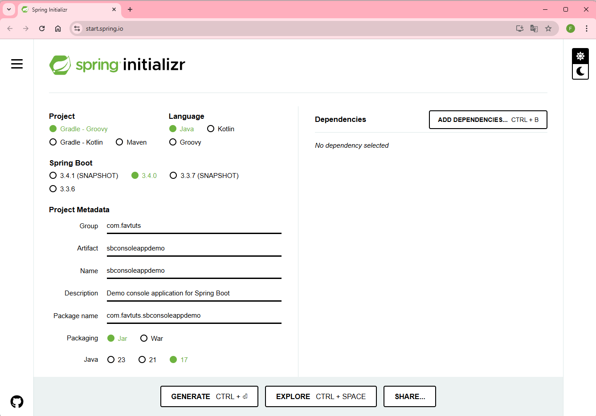

# How to create a Spring Boot console application
* https://tuts.heomi.net/how-to-create-a-spring-boot-console-application/

# Spring Boot Project Initializr

Gradle project type 




# Run the console application

Run without arguments
```bash
$ ./gradlew bootRun
```

Run with argumments
```bash
$ ./gradlew bootRun --args "Mike"
```