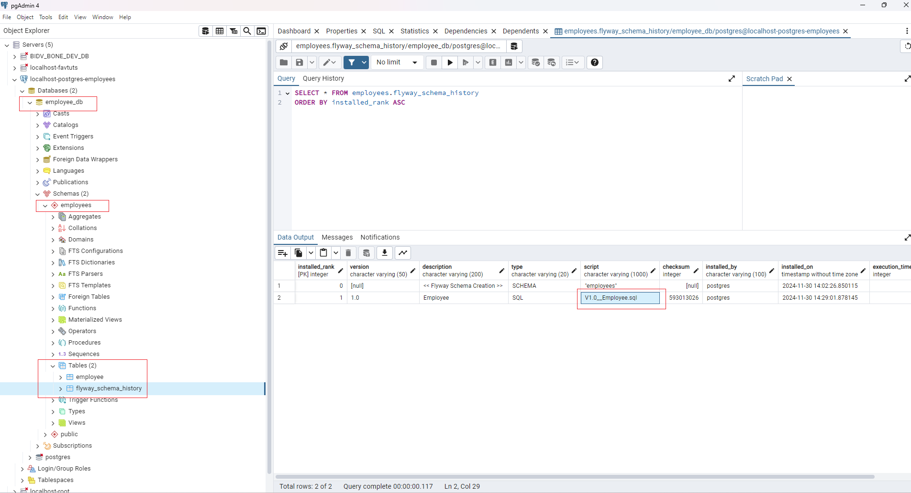

#  Spring Boot with PostgreSQL: A Step-by-Step Guide
* https://tuts.heomi.net/spring-boot-with-postgresql-a-step-by-step-guide/

# Create a Spring Boot project using Spring Initializr

Go to: https://start.spring.io/ and generate Zip file as follow selection:


Once downloaded and extracted the zip file, open this in IntelliJ IDEA, and you can build the project with gradle:
```
gradle clean build
```


# Creating an application layer

In our development, we’ll focus on building the `model`, `service`, `repository`, and `controller` layers. The `Service` layer serves as an intermediary between the `model` and `controller`, containing all the business logic.

# Run PostgreSQL Database as Docker Container
* https://tuts.heomi.net/docker-running-postgresql-as-a-container/

First we create Docker volume to store the PostgreSQL data
```bash
$ docker volume ls
$ docker volume create postgres-volumn
```

Display details for the volume;
```bash
$ docker volume inspect postgres-volumn

[
    {
        "CreatedAt": "2024-11-27T16:48:30Z",
        "Driver": "local",
        "Labels": null,
        "Mountpoint": "/var/lib/docker/volumes/postgres-volumn/_data",
        "Name": "postgres-volumn",
        "Options": null,
        "Scope": "local"
    }
]
```

The below command starts PostgreSQL as a container, and mount the Docker volume `postgres-volumn` to the PostgreSQL data directory `/var/lib/postgresql/data` (this directory inside the container).
```bash
$ docker run --name postgres-container -p 5432:5432 -e POSTGRES_USER=postgres -e POSTGRES_PASSWORD=postgres -e POSTGRES_DB=employee_db -v postgres-volumn:/var/lib/postgresql/data -d postgres:15.4
```

Access the PostgreSQL container log
```bash
$  docker logs postgres-container
```

Stop the PostgreSQL Container
```bash
$ docker stop postgres-container
```

Start the PostgreSQL Container again
```bash
$ docker start postgres-container
```

Removing the PostgreSQL Container
```bash
$ docker rm postgres-container
```

Access the PostgreSQL Container
```bash
$ docker exec -it postgres-container psql -U postgres -d employee_db
```

# Flyway Database Migration

Within flyway, there is a specified location: `db/migration` (located under `resources`). This directory serves as the organizational hub for Flyway to execute SQL-based database migration scripts.

The database migration scripts encompass SQL queries like creating tables or altering tables. These scripts adhere to a naming convention, typically commencing with a version number, an underscore, and a description — e.g., `V1__Create_Table.sql` or `V2__Add_Column.sql`.

Flyway, upon detection, automatically executes these migration scripts in ascending order based on their version numbers. It maintains a metadata table (`flyway_schema_history`) in the database, recording applied scripts.

If you’ve created a table using `V1__Create_Table.sql` and have run the application, subsequent changes to the table’s columns should be addressed in a separate script file, such as `V2__Alter_Table.sql`. Avoid altering the previous script directly. Flyway ensures that migration scripts are uniquely identified by version numbers, preventing reapplication of previously executed scripts.


First, create script file `\src\main\resources\db\migration\V1.0__Employee.sql` in directory
```sql
CREATE TABLE if not exists employee (
id integer,
first_name varchar(250),
last_name varchar(250),
age integer,
designation varchar(250),
phone_number varchar(250),
joined_on date,
address varchar(250),
date_of_birth date,
created_at timestamp,
updated_at timestamp,
PRIMARY KEY (id)
);
```

Then, configure the Datasource in application.yml file to connect PostgreSQL DB:
```yml
spring:
  application:
    name: springboot
  jackson:
    property-naming-strategy: SNAKE_CASE
  flyway:
    locations: classpath:/db/migration
    schemas: employees
    baselineOnMigrate: true
    enabled: true
  datasource:
    driverClassName: org.postgresql.Driver
    url: jdbc:postgresql://localhost:5432/employee_db?currentSchema=employees
    username: postgres
    password: postgres
```

Now when we run the Spring Boot application, it will automatically do the Flyway migration.

If you are using Maven:
```bash
$ mvn clean package
$ mvn spring-boot:run
```

If you are using Gradle:
```bash
$ gradle clean build
$ gradle bootRun
```

You can see the logs:
```
2024-11-30T14:10:40.227+07:00  INFO 18292 --- [springboot] [           main] c.e.springboot.SpringbootApplication     : Starting SpringbootApplication using Java 17.0.13 with PID 18292 (C:\Develop\Java\java-spring-boot-tutorials\spring-boot-postgresql\springboot\build\classes\java\main started by nsd in C:\Develop\Java\java-spring-boot-tutorials\spring-boot-postgresql\springboot)
2024-11-30T14:10:40.229+07:00  INFO 18292 --- [springboot] [           main] c.e.springboot.SpringbootApplication     : No active profile set, falling back to 1 default profile: "default"
2024-11-30T14:10:40.718+07:00  INFO 18292 --- [springboot] [           main] .s.d.r.c.RepositoryConfigurationDelegate : Bootstrapping Spring Data JPA repositories in DEFAULT mode.
2024-11-30T14:10:40.766+07:00  INFO 18292 --- [springboot] [           main] .s.d.r.c.RepositoryConfigurationDelegate : Finished Spring Data repository scanning in 36 ms. Found 1 JPA repository interface.
2024-11-30T14:10:41.591+07:00  INFO 18292 --- [springboot] [           main] o.s.b.w.embedded.tomcat.TomcatWebServer  : Tomcat initialized with port 8080 (http)
2024-11-30T14:10:41.601+07:00  INFO 18292 --- [springboot] [           main] o.apache.catalina.core.StandardService   : Starting service [Tomcat]
2024-11-30T14:10:41.602+07:00  INFO 18292 --- [springboot] [           main] o.apache.catalina.core.StandardEngine    : Starting Servlet engine: [Apache Tomcat/10.1.33]
2024-11-30T14:10:41.644+07:00  INFO 18292 --- [springboot] [           main] o.a.c.c.C.[Tomcat].[localhost].[/]       : Initializing Spring embedded WebApplicationContext
2024-11-30T14:10:41.645+07:00  INFO 18292 --- [springboot] [           main] w.s.c.ServletWebServerApplicationContext : Root WebApplicationContext: initialization completed in 1374 ms
2024-11-30T14:10:41.947+07:00  INFO 18292 --- [springboot] [           main] com.zaxxer.hikari.HikariDataSource       : HikariPool-1 - Starting...
2024-11-30T14:10:42.072+07:00  INFO 18292 --- [springboot] [           main] com.zaxxer.hikari.pool.HikariPool        : HikariPool-1 - Added connection org.postgresql.jdbc.PgConnection@5ab7ac02
2024-11-30T14:10:42.074+07:00  INFO 18292 --- [springboot] [           main] com.zaxxer.hikari.HikariDataSource       : HikariPool-1 - Start completed.
2024-11-30T14:10:42.103+07:00  INFO 18292 --- [springboot] [           main] o.f.c.i.resource.ResourceNameValidator   : 1 SQL migrations were detected but not run because they did not follow the filename convention.
2024-11-30T14:10:42.103+07:00  INFO 18292 --- [springboot] [           main] o.f.c.i.resource.ResourceNameValidator   : Set 'validateMigrationNaming' to true to fail fast and see a list of the invalid file names.
2024-11-30T14:10:42.108+07:00  INFO 18292 --- [springboot] [           main] org.flywaydb.core.FlywayExecutor         : Database: jdbc:postgresql://localhost:5432/employee_db?currentSchema=employees (PostgreSQL 15.4)
2024-11-30T14:10:42.145+07:00  INFO 18292 --- [springboot] [           main] o.f.core.internal.command.DbValidate     : Successfully validated 1 migration (execution time 00:00.019s)
2024-11-30T14:10:42.186+07:00  INFO 18292 --- [springboot] [           main] o.f.core.internal.command.DbMigrate      : Current version of schema "employees": null
2024-11-30T14:10:42.189+07:00  INFO 18292 --- [springboot] [           main] o.f.core.internal.command.DbMigrate      : Schema "employees" is up to date. No migration necessary.
2024-11-30T14:10:42.281+07:00  INFO 18292 --- [springboot] [           main] o.hibernate.jpa.internal.util.LogHelper  : HHH000204: Processing PersistenceUnitInfo [name: default]
2024-11-30T14:10:42.326+07:00  INFO 18292 --- [springboot] [           main] org.hibernate.Version                    : HHH000412: Hibernate ORM core version 6.6.2.Final
2024-11-30T14:10:42.356+07:00  INFO 18292 --- [springboot] [           main] o.h.c.internal.RegionFactoryInitiator    : HHH000026: Second-level cache disabled
2024-11-30T14:10:42.572+07:00  INFO 18292 --- [springboot] [           main] o.s.o.j.p.SpringPersistenceUnitInfo      : No LoadTimeWeaver setup: ignoring JPA class transformer
2024-11-30T14:10:42.657+07:00  INFO 18292 --- [springboot] [           main] org.hibernate.orm.connections.pooling    : HHH10001005: Database info:
	Database JDBC URL [Connecting through datasource 'HikariDataSource (HikariPool-1)']
	Database driver: undefined/unknown
	Database version: 15.4
	Autocommit mode: undefined/unknown
	Isolation level: undefined/unknown
	Minimum pool size: undefined/unknown
	Maximum pool size: undefined/unknown
2024-11-30T14:10:43.281+07:00  INFO 18292 --- [springboot] [           main] o.h.e.t.j.p.i.JtaPlatformInitiator       : HHH000489: No JTA platform available (set 'hibernate.transaction.jta.platform' to enable JTA platform integration)
2024-11-30T14:10:43.284+07:00  INFO 18292 --- [springboot] [           main] j.LocalContainerEntityManagerFactoryBean : Initialized JPA EntityManagerFactory for persistence unit 'default'
2024-11-30T14:10:43.535+07:00  WARN 18292 --- [springboot] [           main] JpaBaseConfiguration$JpaWebConfiguration : spring.jpa.open-in-view is enabled by default. Therefore, database queries may be performed during view rendering. Explicitly configure spring.jpa.open-in-view to disable this warning
2024-11-30T14:10:44.006+07:00  INFO 18292 --- [springboot] [           main] o.s.b.a.e.web.EndpointLinksResolver      : Exposing 1 endpoint beneath base path '/actuator'
2024-11-30T14:10:44.072+07:00  INFO 18292 --- [springboot] [           main] o.s.b.w.embedded.tomcat.TomcatWebServer  : Tomcat started on port 8080 (http) with context path '/'
2024-11-30T14:10:44.086+07:00  INFO 18292 --- [springboot] [           main] c.e.springboot.SpringbootApplication     : Started SpringbootApplication in 4.229 seconds (process running for 4.498)
```

Now you can see the table `employee` was created under the schema `employees`




# API testing with Postman

Save an employee record:
```bash
curl --location 'http://localhost:8080/employee/v1/' \
--header 'Content-Type: application/json' \
--data '{
    "id" : 1,
    "first_name" : "Pabitra",
    "last_name" : "Jena",
    "age": 25,
    "designation": "Engineer - Target Tech",
    "phone_number": "+91 1234567890",
    "joined_on": "2021-10-06",
    "address": "Bangalore",
    "date_of_birth": "1999-05-26"
}'
```

Get an employee record by Id:
```bash
curl --location 'http://localhost:8080/employee/v1/1'
```

Get all employee records:
```bash
curl --location 'http://localhost:8080/employee/v1/'
```

Update an employee record:
```bash
curl --location --request DELETE 'http://localhost:8080/employee/v1/1'
```