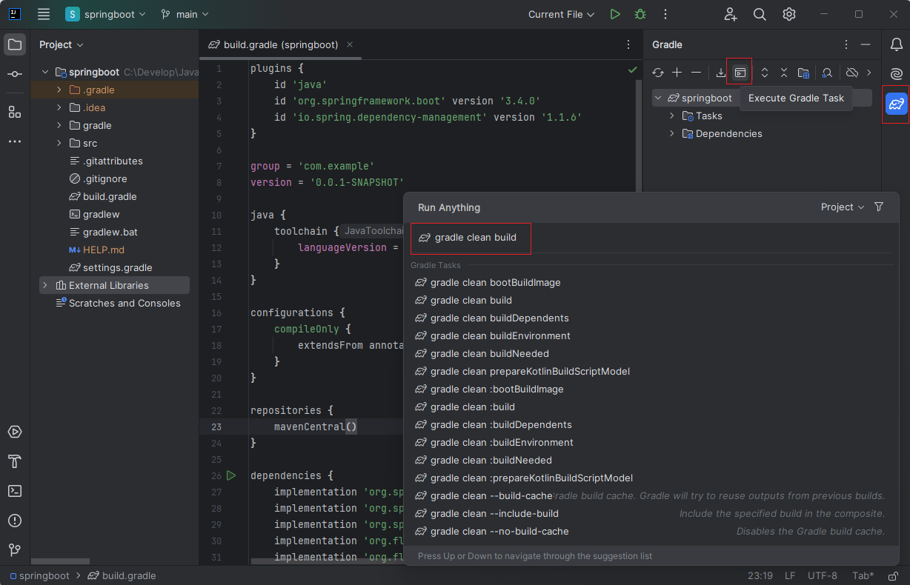

#  Spring Boot with PostgreSQL: A Step-by-Step Guide
* https://tuts.heomi.net/spring-boot-with-postgresql-a-step-by-step-guide/

# Create a Spring Boot project using Spring Initializr

Go to: https://start.spring.io/ and generate Zip file as follow selection:


Once downloaded and extracted the zip file, open this in IntelliJ IDEA, and you can build the project with gradle:
```
gradle clean build
```



# Creating an application layer

In our development, we’ll focus on building the `model`, `service`, `repository`, and `controller` layers. The `Service` layer serves as an intermediary between the `model` and `controller`, containing all the business logic.

# Run PostgreSQL Database as Docker Container
* https://tuts.heomi.net/docker-running-postgresql-as-a-container/

First we create Docker volume to store the PostgreSQL data
```bash
$ docker volume ls
$ docker volume create postgres-volumn
```

Display details for the volume;
```bash
$ docker volume inspect postgres-volumn

[
    {
        "CreatedAt": "2024-11-27T16:48:30Z",
        "Driver": "local",
        "Labels": null,
        "Mountpoint": "/var/lib/docker/volumes/postgres-volumn/_data",
        "Name": "postgres-volumn",
        "Options": null,
        "Scope": "local"
    }
]
```

The below command starts PostgreSQL as a container, and mount the Docker volume `postgres-volumn` to the PostgreSQL data directory `/var/lib/postgresql/data` (this directory inside the container).
```bash
$ docker run --name postgres-container -e POSTGRES_USER=postgres -e POSTGRES_PASSWORD=postgres -e POSTGRES_DB=employee_db -v postgres-volumn:/var/lib/postgresql/data -d postgres:15.4
```
